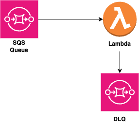
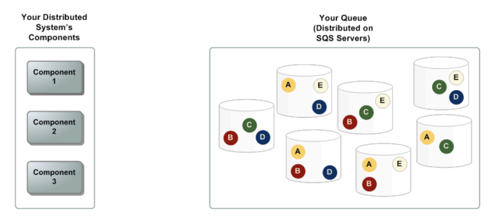
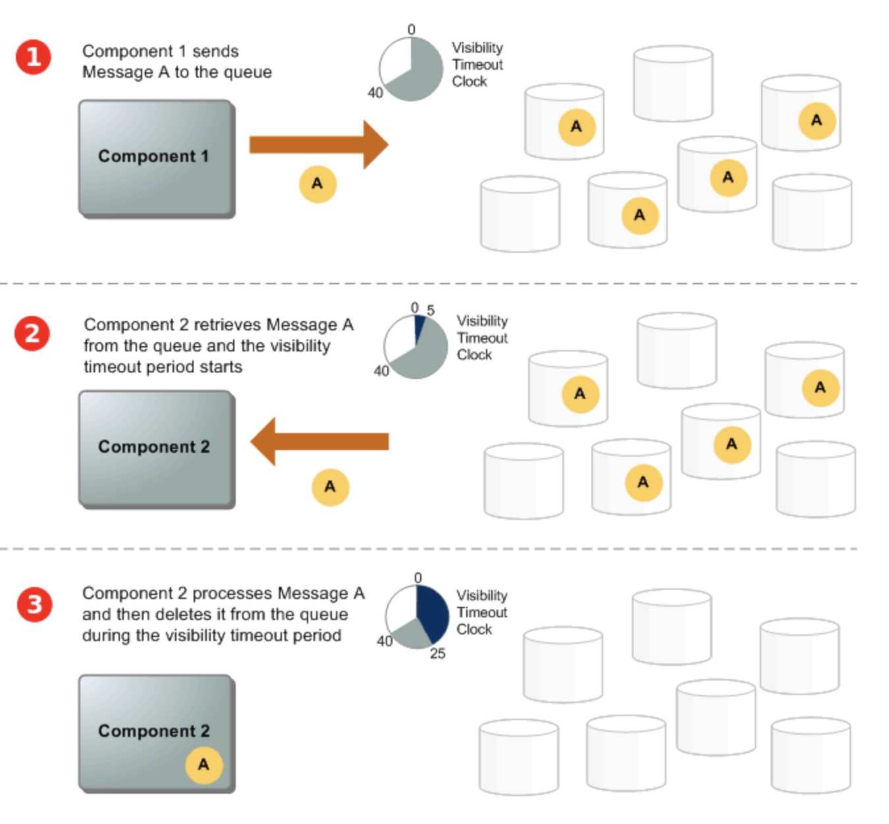

```toc
# This code block gets replaced with the TOC
```

## Intro

One of the most common patterns in serverless applications is triggering a lambda when an SQS queue receives a message. This is called using SQS as an event source for lambda. Let's look at the simple architecture we're building:

## Architecture



The flow is quite simple: We send a message to the SQS queue from console (for now) and have the lambda print the received message. Any errors go into the DLQ. Here's a sample output from lambda logs:

```text
2023-10-27T23:48:53.251Z	74f78d0e-7faa-506e-ae9a-d0b83136e687	INFO	record: {
    "messageId": "67fc17f2",
    "receiptHandle": "AQEBx",
    "body": "This is a test message from the console my friend!",
    "attributes": {
        "ApproximateReceiveCount": "1",
        "SentTimestamp": "1698450532855",
        "SenderId": "AIDA",
        "ApproximateFirstReceiveTimestamp": "1698450532865"
    },
    "messageAttributes": {},
    "md5OfBody": "405ss",
    "eventSource": "aws:sqs",
    "eventSourceARN": "arn:aws:sqs:us-east-1:X:SQSToLambdaStack-notificationsQueue8852CCBB-6OA4tVr4CWFS",
    "awsRegion": "us-east-1"
}
```

## SQS

More details on architecture can be found [here](https://docs.aws.amazon.com/AWSSimpleQueueService/latest/SQSDeveloperGuide/sqs-basic-architecture.html)

In the scenario above, our system has a producer (components that send messages to the queue, ie me!) and consumers (components that receive messages from the queue ie lambda). The queue redundantly stores the messages across multiple Amazon SQS servers:



The following scenario describes the lifecycle of an Amazon SQS message in a queue, from creation to deletion.



1. A producer (component 1) sends message A to a queue, and the message is distributed across the Amazon SQS servers redundantly.

2. When a consumer (component 2) is ready to process messages, it consumes messages from the queue, and message A is returned. While message A is being processed, it remains in the queue and isn't returned to subsequent receive requests for the duration of the visibility timeout.

3. The consumer (component 2) deletes message A from the queue to prevent the message from being received and processed again when the visibility timeout expires.

Amazon SQS automatically deletes messages that have been in a queue for more than the maximum message retention period. The default message retention period is 4 days. However, you can set the message retention period to a value from 60 seconds to 1,209,600 seconds (14 days).

Amazon SQS supports two types of queues – standard queues and FIFO queues:

### Standard Queues

- Unlimited Throughput: Standard queues support a nearly unlimited number of API calls per second, per API action
- At-Least-Once Delivery: A message is delivered at least once, but occasionally more than one copy of a message is delivered. Amazon SQS stores copies of your messages on multiple servers for redundancy and high availability. On rare occasions, one of the servers that stores a copy of a message might be unavailable when you receive or delete a message. If this occurs, the copy of the message isn't deleted on that unavailable server, and you might get that message copy again when you receive messages. Design your applications to be idempotent (they should not be affected adversely when processing the same message more than once).
- Best-Effort Ordering: Occasionally, messages are delivered in an order different from which they were sent. It makes a best effort to preserve the order of messages, but more than one copy of a message might be delivered out of order.
- Use standard queues to send data between applications when the throughput is important, for example:
  - Decouple live user requests from intensive background work: let users upload media while resizing or encoding it.
  - Allocate tasks to multiple worker nodes: process a high number of credit card validation requests.
  - Batch messages for future processing: schedule multiple entries to be added to a database.

### FIFO queues

- High Throughput: If you use batching, FIFO queues support up to 3,000 messages per second, per API method (SendMessageBatch, ReceiveMessage, or DeleteMessageBatch). The 3,000 messages per second represent 300 API calls, each with a batch of 10 messages.
- Exactly-Once Processing: A message is delivered once and remains available until a consumer processes and deletes it. Duplicates aren't introduced into the queue.
- First-In-First-Out Delivery: The order in which messages are sent and received is strictly preserved.

### Identifiers for SQS

In the payload we saw earlier, there were a few different items. Let's look at each:

- Message Id: Each message receives a system-assigned message ID that Amazon SQS returns to you in the SendMessage response. This identifier is useful for identifying messages. The maximum length of a message ID is 100 characters.
- Receipt handle: Every time you receive a message from a queue, you receive a receipt handle for that message. This handle is associated with the action of receiving the message, not with the message itself. To delete the message or to change the message visibility, you must provide the receipt handle (not the message ID). Thus, you must always receive a message before you can delete it (you can't put a message into the queue and then recall it). The maximum length of a receipt handle is 1,024 characters.

## Using lambda with SQS

You can use an AWS Lambda function to process messages in an Amazon SQS queue. Lambda polls the queue and invokes your Lambda function synchronously with an event that contains queue messages. To allow your function time to process each batch of records, set the source queue's visibility timeout to at least six times the [timeout that you configure](https://docs.aws.amazon.com/lambda/latest/dg/configuration-function-common.html#configuration-common-summary) on your function. The extra time allows for Lambda to retry if your function is throttled while processing a previous batch.

You can specify another queue to act as a dead-letter queue for messages that your Lambda function can't process.

The Lambda execution role must include the following permissions:

```ts
sqs: DeleteMessage

sqs: GetQueueAttributes

sqs: ReceiveMessage
```

If you associate an encrypted queue with a Lambda function, add the `kms:Decrypt` permission to the Lambda execution role.

### Event source mappings

Event source mappings allow us to determine what invokes the lambda. Lambda polls the queue and invokes your Lambda function synchronously with an event that contains queue messages. Lambda reads messages in batches and invokes your function once for each batch. When your function successfully processes a batch, Lambda deletes its messages from the queue.

When Lambda reads a batch, the messages stay in the queue but are hidden for the length of the queue's visibility timeout. If your function successfully processes the batch, Lambda deletes the messages from the queue. **By default, if your function encounters an error while processing a batch, all messages in that batch become visible in the queue again**. For this reason, your function code must be able to process the same message multiple times without unintended side effects.

To prevent Lambda from processing a message multiple times, you can either configure your event source mapping to include [batch item failures](https://docs.aws.amazon.com/lambda/latest/dg/with-sqs.html#services-sqs-batchfailurereporting) in your function response, or you can use the Amazon SQS API action [DeleteMessage](https://docs.aws.amazon.com/AWSSimpleQueueService/latest/APIReference/API_DeleteMessage.html) to remove messages from the queue as your Lambda function successfully processes them.

Example SQS message event looks like this:

```json
{
  "Records": [
    {
      "messageId": "059f36b4-87a3-44ab-83d2-661975830a7d",
      "receiptHandle": "AQEBwJnKyrHigUMZj6rYigCgxlaS3SLy0a...",
      "body": "Test message.",
      "attributes": {
        "ApproximateReceiveCount": "1",
        "SentTimestamp": "1545082649183",
        "SenderId": "AIDAIENQZJOLO23YVJ4VO",
        "ApproximateFirstReceiveTimestamp": "1545082649185"
      },
      "messageAttributes": {},
      "md5OfBody": "e4e68fb7bd0e697a0ae8f1bb342846b3",
      "eventSource": "aws:sqs",
      "eventSourceARN": "arn:aws:sqs:us-east-2:123456789012:my-queue",
      "awsRegion": "us-east-2"
    },
    {
      "messageId": "2e1424d4-f796-459a-8184-9c92662be6da",
      "receiptHandle": "AQEBzWwaftRI0KuVm4tP+/7q1rGgNqicHq...",
      "body": "Test message.",
      "attributes": {
        "ApproximateReceiveCount": "1",
        "SentTimestamp": "1545082650636",
        "SenderId": "AIDAIENQZJOLO23YVJ4VO",
        "ApproximateFirstReceiveTimestamp": "1545082650649"
      },
      "messageAttributes": {},
      "md5OfBody": "e4e68fb7bd0e697a0ae8f1bb342846b3",
      "eventSource": "aws:sqs",
      "eventSourceARN": "arn:aws:sqs:us-east-2:123456789012:my-queue",
      "awsRegion": "us-east-2"
    }
  ]
}
```

By default:

- Lambda polls up to 10 messages in your queue at once and sends that batch to your function.
- To avoid invoking the function with a small number of records, you can tell the event source to buffer records for up to 5 minutes by configuring a **batch window**.
- Before invoking the function, Lambda continues to poll messages from the SQS standard queue until:
  - The batch window expires
  - The invocation payload size quota is reached, or
  - The configured maximum batch size is reached.

**If you're using a batch window and your SQS queue contains very low traffic, Lambda might wait for up to 20 seconds before invoking your function. This is true even if you set a batch window lower than 20 seconds.**

## DLQs

Amazon SQS supports dead-letter queues (DLQ), which other queues (source queues) can target for messages that can't be processed (consumed) successfully. Dead-letter queues are useful for debugging your application or messaging system because they let you isolate unconsumed messages to determine why their processing didn't succeed.

The main task of a dead-letter queue is to handle the lifecycle of unconsumed messages. A dead-letter queue lets you set aside and isolate messages that can't be processed correctly to determine why their processing didn't succeed. Setting up a dead-letter queue allows you to do the following:

- Configure an alarm for any messages moved to a dead-letter queue.
- Examine logs for exceptions that might have caused messages to be moved to a dead-letter queue.
- Analyze the contents of messages moved to a dead-letter queue to diagnose software or the producer's or consumer's hardware issues.
- Determine whether you have given your consumer sufficient time to process messages.

The redrive policy specifies the source queue, the dead-letter queue, and the conditions under which Amazon SQS moves messages from the former to the latter if the consumer of the source queue fails to process a message a specified number of times. The `maxReceiveCount` is the number of times a consumer tries receiving a message from a queue without deleting it before being moved to the dead-letter queue. Setting the `maxReceiveCount` to a low value such as 1 would result in any failure to receive a message to cause the message to be moved to the dead-letter queue. Such failures include network errors and client dependency errors. To ensure that your system is resilient against errors, set the `maxReceiveCount` high enough to allow for sufficient retries.

The redrive task uses Amazon SQS's `SendMessageBatch`, `ReceiveMessage`, and `DeleteMessageBatch` APIs on behalf of the user to redrive the messages. Therefore, all redriven messages are considered new messages with a new `messageid`, `enqueueTime`, and `retention period`.

For standard queues, the expiration of a message is always based on its original enqueue timestamp. When a message is moved to a dead-letter queue, the enqueue timestamp is unchanged. The `ApproximateAgeOfOldestMessage` metric indicates when the message moved to the dead-letter queue, not when the message was originally sent. For example, assume that a message spends 1 day in the original queue before it's moved to a dead-letter queue. If the dead-letter queue's retention period is 4 days, the message is deleted from the dead-letter queue after 3 days and the `ApproximateAgeOfOldestMessage` is 3 days. Thus, it is a best practice to always set the retention period of a dead-letter queue to be longer than the retention period of the original queue.

## Lambda responses

Lambda can return a success or a failure in the following [scenarios](https://docs.aws.amazon.com/lambda/latest/dg/with-sqs.html#:~:text=Success%20and%20failure%20conditions)

Lambda treats a batch as a complete success if your function returns any of the following:

- An empty batchItemFailures list
- A null batchItemFailures list
- An empty EventResponse
- A null EventResponse

Lambda treats a batch as a complete failure if your function returns any of the following:

- An invalid JSON response
- An empty string itemIdentifier
- A null itemIdentifier
- An itemIdentifier with a bad key name
- An itemIdentifier value with a message ID that doesn't exist

## Code!

Now that we understand SQS queues and Lambdas (a little!), let's look at the CDK and lambda code for our daigram:


Let's start with creation of SQS (both regular SQS and DLQ):

```ts
  private createQueue() {
    const queue = new Queue(this, "myQueue", {
      visibilityTimeout: Duration.seconds(5),
      encryption: QueueEncryption.KMS,
      encryptionMasterKey: this.kmsKey,
    });
    return queue;
  }

    private createDeadLetterQueue(): Queue {
    const dlq = new Queue(this, "dlq", {
      retentionPeriod: Duration.days(14),
      visibilityTimeout: Duration.seconds(30),
      encryption: QueueEncryption.KMS,
      encryptionMasterKey: this.kmsKey,
    });

    return dlq;
  }
```

- `visibilityTimeout`: For our queue, it is 5 seconds while for the DLQ it is 30 seconds. A message remains in the queue and isn't returned to subsequent receive requests for the duration of the visibility timeout. ie, the consumer has this amount of time to process and delete the message from the queue.

Next up, the lambda:

```ts
  private createLambdaFunction() {
    const lambdaRole = new Role(this, "SQSTriggeredLambdaRole", {
      assumedBy: new ServicePrincipal("lambda.amazonaws.com"),
      roleName: "SQSTriggeredLambdaRole",
    });

    lambdaRole.addToPolicy(
      new PolicyStatement({
        effect: Effect.ALLOW,
        resources: [this.notificationsQueue.queueArn],
        actions: [
          "sqs:ReceiveMessage",
          "sqs:DeleteMessage",
          "sqs:GetQueueAttributes",
          "sqs:SendMessage",
        ],
      })
    );

    lambdaRole.addManagedPolicy({
      managedPolicyArn:
        "arn:aws:iam::aws:policy/service-role/AWSLambdaBasicExecutionRole",
    });

    const lambda = new NodejsFunction(this, "SQSTriggeredLambda", {
      functionName: "SQSTriggeredLambda",
      runtime: Runtime.NODEJS_18_X,
      handler: "handler",
      entry: "lambdas/sqsToLambda.ts",
      tracing: Tracing.ACTIVE,
      memorySize: 256,
      timeout: Duration.seconds(5),
      role: lambdaRole,
      deadLetterQueue: this.dlq,
    });

    return lambda;
  }
```

First, we have the permissions for this lambda. We create a role called `SQSTriggeredLambdaRole` to which we'll assign the permissions. This role will then be assumed by our lambda. Next, we add SQS and lambda execution permissions to the role. Finally, we create the lambda to use runtime of NodeJS18, a memory size of 256 and timeout duration of 5 seconds.

Here's the actual lambda function code:

```ts
import { SQSBatchResponse, SQSEvent, SQSRecord } from "aws-lambda"
import {
  SQS_NO_BATCH_ITEM_FAILURES,
  createSQSBatchResponse,
} from "../lib/utils/responseUtils"

/**
 * Reads from SQS
 * @param event: SQS event
 */
export const handler = async (event: SQSEvent): Promise<SQSBatchResponse> => {
  // Get the object from the event and show its content
  const records: SQSRecord[] = event.Records
  const failedItems: string[] = []
  records.forEach(record => {
    if (record.body.includes("error")) {
      failedItems.push(record.messageId)
    } else {
      console.log(record.body)
    }
  })

  if (failedItems.length > 0) {
    return createSQSBatchResponse([...failedItems])
  }

  return SQS_NO_BATCH_ITEM_FAILURES
}
```

Lambda function accepts an SQSEvent and returns a SQSBatchResponse promise:

`export const handler = async (event: SQSEvent): Promise<SQSBatchResponse> => {...}`

We create an error array called `failedItems` in case there're any failures. We then iterate over the `Records` array (that's what SQS sends to the lambda). If the body contains the word error, we'll add the message id to `failedItems`. Otherwise, we'll simply print the message body.

Finally, if there're any failed items, we create a SQSBatchResponse type like so:

```ts
import { SQSBatchItemFailure, SQSBatchResponse } from "aws-lambda"

export function createSQSBatchResponse(
  failedItems: string[]
): SQSBatchResponse {
  const failures: SQSBatchItemFailure[] = []
  failedItems.forEach(item => failures.push({ itemIdentifier: item }))

  return { batchItemFailures: failures }
}

export const SQS_NO_BATCH_ITEM_FAILURES = {
  batchItemFailures: [],
}
```

A failure response would look like this:

```json
{
  "batchItemFailures": [
    {
      "itemIdentifier": "2e1424d4-f796-459a-8184-9c92662be6da"
    }
  ]
}
```

If there're no failures, we simply return an empty failures array.

## Appendix

- [SQS Architecture](https://docs.aws.amazon.com/AWSSimpleQueueService/latest/SQSDeveloperGuide/sqs-basic-architecture.html)
- [Using lambda with SQS](https://docs.aws.amazon.com/lambda/latest/dg/with-sqs.html)
