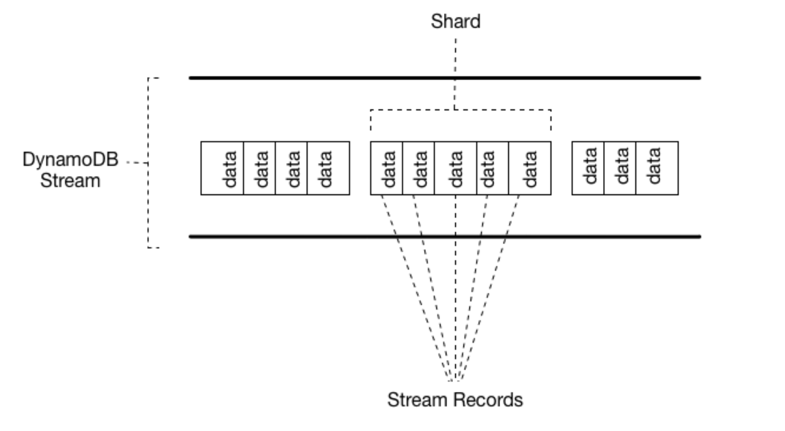

```toc
# This code block gets replaced with the TOC
```

## DynamoDB

Let's talk about Amazon's NoSQL database offering: DynamoDB. It is a fully managed NoSQL database service that provides fast and predictable performance with seamless scalability. Detailed docs on using lambda with DynamoDB [here](https://docs.aws.amazon.com/lambda/latest/dg/with-ddb.html).

You can use an AWS Lambda function to process records in an [Amazon DynamoDB stream](https://docs.aws.amazon.com/amazondynamodb/latest/developerguide/Streams.html). With DynamoDB Streams, you can trigger a Lambda function to perform additional work each time a DynamoDB table is updated. Lambda reads records from the stream and invokes your function synchronously with an event that contains stream records. Lambda reads records in batches and invokes your function to process records from the batch.

DynamoDB Streams is a feature that captures data modification events in DynamoDB tables. The data about these events appear in the stream in near-real time, and in the order that the events occurred.

Each event is represented by a stream record. If you enable a stream on a table, DynamoDB Streams writes a stream record whenever one of the following events occurs:

- A new item is added to the table: The stream captures an image of the entire item, including all of its attributes.
- An item is updated: The stream captures the "before" and "after" image of any attributes that were modified in the item.
- An item is deleted from the table: The stream captures an image of the entire item before it was deleted.

Lambda will receive the record in the following format:

```json
{
  "Records": [
    {
      "eventID": "1",
      "eventVersion": "1.0",
      "dynamodb": {
        "Keys": {
          "Id": {
            "N": "101"
          }
        },
        "NewImage": {
          "Message": {
            "S": "New item!"
          },
          "Id": {
            "N": "101"
          }
        },
        "StreamViewType": "NEW_AND_OLD_IMAGES",
        "SequenceNumber": "111",
        "SizeBytes": 26
      },
      "awsRegion": "us-west-2",
      "eventName": "INSERT",
      "eventSourceARN": "arn:aws:dynamodb:us-west-2:111122223333:table/TestTable/stream/2015-05-11T21:21:33.291",
      "eventSource": "aws:dynamodb"
    },
    {
      "eventID": "2",
      "eventVersion": "1.0",
      "dynamodb": {
        "OldImage": {
          "Message": {
            "S": "New item!"
          },
          "Id": {
            "N": "101"
          }
        },
        "SequenceNumber": "222",
        "Keys": {
          "Id": {
            "N": "101"
          }
        },
        "SizeBytes": 59,
        "NewImage": {
          "Message": {
            "S": "This item has changed"
          },
          "Id": {
            "N": "101"
          }
        },
        "StreamViewType": "NEW_AND_OLD_IMAGES"
      },
      "awsRegion": "us-west-2",
      "eventName": "MODIFY",
      "eventSourceARN": "arn:aws:dynamodb:us-west-2:111122223333:table/TestTable/stream/2015-05-11T21:21:33.291",
      "eventSource": "aws:dynamodb"
    }
  ]
}
```

Each stream record also contains the name of the table, the event timestamp, and other metadata. Stream records have a lifetime of 24 hours; after that, they are automatically removed from the stream.

You can use DynamoDB Streams together with AWS Lambda to create a trigger—code that runs automatically whenever an event of interest appears in a stream. For example, consider a Customers table that contains customer information for a company. Suppose that you want to send a "welcome" email to each new customer. You could enable a stream on that table, and then associate the stream with a Lambda function. The Lambda function would run whenever a new stream record appears, but only process new items added to the Customers table. For any item that has an `EmailAddress` attribute, the Lambda function would invoke Amazon Simple Email Service (Amazon SES) to send an email to that address.

### Streams

More details [here](https://docs.aws.amazon.com/amazondynamodb/latest/developerguide/Streams.html#:~:text=a%20new%20one.-,Reading%20and%20processing%20a%20stream,-To%20read%20and)

A stream consists of stream records. Each stream record represents a single data modification in the DynamoDB table to which the stream belongs. Each stream record is assigned a sequence number, reflecting the order in which the record was published to the stream.

Stream records are organized into groups, or shards. Each shard acts as a container for multiple stream records, and contains information required for accessing and iterating through these records. The stream records within a shard are removed automatically after 24 hours.

Shards are ephemeral: They are created and deleted automatically, as needed. Any shard can also split into multiple new shards; this also occurs automatically. (It's also possible for a parent shard to have just one child shard.) A shard might split in response to high levels of write activity on its parent table, so that applications can process records from multiple shards in parallel.

The following diagram shows the relationship between a stream, shards in the stream, and stream records in the shards:



The AWS Lambda service polls the stream for new records four times per second. When new stream records are available, your Lambda function is synchronously invoked. You can subscribe up to two Lambda functions to the same DynamoDB stream. Let's look at an example setup where a DynamoDB table is created and has a lambda listening to its streams.

## Code!

Let's start by creating our lambda via the CDK. This is the same lambda we've seen in the past for Lambda -> SQS flow only with different permissions:

```ts
  private createLambdaFunction(tableStreamArn: string) {
    const lambdaRole = new Role(this, "DynamoDBStreamLambdaRole", {
      assumedBy: new ServicePrincipal("lambda.amazonaws.com"),
      roleName: "DynamoDBStreamLambdaRole",
    });

    lambdaRole.addToPolicy(
      new PolicyStatement({
        actions: [
          "dynamodb:DescribeStream",
          "dynamodb:GetRecords",
          "dynamodb:GetShardIterator",
          "dynamodb:ListStreams",
        ],
        resources: [tableStreamArn],
      })
    );

    lambdaRole.addManagedPolicy({
      managedPolicyArn:
        "arn:aws:iam::aws:policy/service-role/AWSLambdaBasicExecutionRole",
    });

    const lambda = new NodejsFunction(this, "DynamoDBStreamLambda", {
      functionName: "DynamoDBStreamLambda",
      runtime: Runtime.NODEJS_18_X,
      handler: "handler",
      entry: "lambdas/dynamoDBStreamLambda.ts",
      tracing: Tracing.ACTIVE,
      memorySize: 256,
      timeout: Duration.seconds(5),
      role: lambdaRole,
    });

    return lambda;
  }
```

Next up, here's how we create our dynamoDB:

```ts
  private createDynamoDBTable() {
    const dynamoDBTable = new Table(this, "CustomerOrdersTable", {
      tableName: "CustomerOrdersTable",
      partitionKey: { name: "id", type: AttributeType.STRING },
      stream: StreamViewType.NEW_IMAGE,
      billingMode: BillingMode.PAY_PER_REQUEST,
    });

    return dynamoDBTable;
  }
```

Notice the `stream` value above. DynamoDB `StreamViewType` determines what information is captured in the DynamoDB stream when a data modification occurs. There are four possible `StreamViewTypes`:

- `KEYS_ONLY`: Only the key attributes of the modified item are written to the stream.
- `NEW_IMAGE`: The entire item, as it appears after the modification, is written to the stream.
- `OLD_IMAGE`: The entire item, as it appeared before the modification, is written to the stream.
- `NEW_AND_OLD_IMAGES`: Both the new and old images of the item are written to the stream.

You can choose the `StreamViewType` when enabling a DynamoDB stream for a table. Once a stream has been set up, it is not possible to edit the `StreamViewType`.

Next up, we need to set up event source for our lambda (ie what would trigger the lambda):

```ts
this.lambda.addEventSource(
  new DynamoEventSource(this.dynamoDBTable, {
    startingPosition: StartingPosition.TRIM_HORIZON,
  })
)
```

The `StartingPosition` parameter is used to specify the point at which the application reads from the DynamoDB stream. There are three possible values for `StartingPosition`:

- `NOW`: This value allows you to start reading just after the most recent record in the stream, starting at the timestamp of the customer's request.
- `TRIM_HORIZON`: With this value, you can start reading at the last untrimmed record in the stream, which is the oldest record available in the stream.
- `LAST_STOPPED_POINT`: This value is used to resume reading from where the application last stopped reading.

With what we've defined above, lambda will read the oldest available record in the stream.

Here's the sample payload received in our lambda when we create a new entry in our DDB:

```ts
{
    "level": "INFO",
    "message": "received the following in dynamoDB lambda:
    {
      \"Records\":[
        {
          \"eventID\":\"05b1ab76243a9468ea07014fa793ed3d\",
          \"eventName\":\"INSERT\",
          \"eventVersion\":\"1.1\",
          \"eventSource\":\"aws:dynamodb\",
          \"awsRegion\":\"us-east-1\",
          \"dynamodb\":{\"ApproximateCreationDateTime\":1703457600,
          \"Keys\":{\"id\":{\"S\":\"1\"}},
          \"NewImage\":{
            \"customerEmail\":{\"S\":\"firstcustomer@gmail.com\"},
            \"id\":{\"S\":\"1\"},
            \"customerName\":{\"S\":\"First Customer\"}
          },
          \"SequenceNumber\":\"100000000078416239681\",
          \"SizeBytes\":68,
          \"StreamViewType\":\"NEW_IMAGE\"},
          \"eventSourceARN\":\"arn:aws:dynamodb:us-east-1:063712744160:table/CustomerOrdersTable/stream/2023-12-24T22:29:00.593\"
        }
      ]
    }",
    "service": "service_undefined",
    "timestamp": "2023-12-24T22:40:01.104Z",
    "xray_trace_id": "1-6588b340-28a13a3ce35cb81a845225ba"
}
```

and here's what the lambda code looks like:

```ts
import { type DynamoDBStreamEvent } from "aws-lambda"
import { Logger } from "@aws-lambda-powertools/logger"

const logger = new Logger()

/**
 * Reads from SQS
 * @param event
 */
export const handler = async (event: DynamoDBStreamEvent) => {
  // Get the object from the event and show its content type
  logger.info(
    `received the following in dynamoDB lambda: ${JSON.stringify(event)}`
  )
}
```
