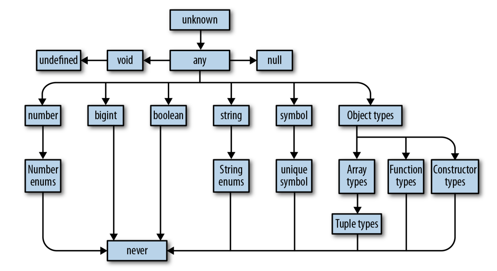

```toc
# This code block gets replaced with the TOC
```

## Compiler

Here's how typescript code is covnerted to bytecode:

1. Your typescript code is parsed by a special program called a compiler, which transforms it into an **abstract syntax tree (AST)**, a data structure that ignores things like whitespace, comments etc. We'll call this typescript AST.
2. Generated AST is then checked by the typechecker.
3. Once types are validated, typescript AST is converted to JavaScript source.
4. Javascript source is converted to Javascript AST.
5. The compiler then converts that AST to a lower-level representation called **bytecode**.
6. You can feed that bytecode into another program called a **runtime** to evaluate it and get a result.

So when you run a program, what you’re really doing is telling the runtime to evaluate the bytecode generated by the compiler from the AST parsed from your source code.

Here's the flow:

```ts
code -> TS AST -> Typecheck -> JS Source -> JS AST -> bytecode -> runtime
```

Your program’s types will never affect your program’s gener ated output, and are only used for typechecking. This feature makes it foolproof to
play around with, update, and improve your program’s types, without risking breaking your application.

## Type System

TypeScript is a mixture of 2 of type systems:

- explicit declaration
- automatic inference

Meaning you can explicitly annotate your types, or you can let TypeScript infer most of them for you.

To explicitly signal to TypeScript what your types are, use annotations. Annotations take the form **_value: type_**

A few examples:

```ts
let a: number = 1 // a is a number
let b: string = "2" // b is a string
let c: boolean[] = [true, false] // c is an array of booleans
```

And if you want TypeScript to infer your types for you, just leave them off and let TypeScript get to work:

```ts
let a = 1 // a is a number
let b = "2" // b is a string
let c = [true, false] // c is an array of booleans
```

TypeScript is a gradually typed language. That means that TypeScript works best when it knows the types of everything in your program at compile time, but it doesn’t have to know every type in order to compile your program. Even in an untyped program TypeScript can infer some types for you and catch some mistakes, but without knowing the types for everything, it will let a lot of mistakes slip through to your users.

TypeScript statically analyzes your code for errors, and shows them to you before you run it. TypeScript throws both syntax-related errors and type-related errors at compile time.

## Types

A **type** is **_a set of values and the things you can do with them._** Here's typescript's type hierarchy:



Example of type annotated function:

```ts
function squareOf(n) {
  return n * n
}
```

`squareOf(4)` will return 16. Typescript will also allow you to do: `squareOf('a')` which will return `NaN`. Explicitly annotate your types:

```ts
function squareOf(n: number) {
  return n * n
}
```

Now, if you try `squareOf('a')`, you'll get an error saying: `Argument of type 'string' is not assignable to parameter of type 'number'.ts(2345)`. Without a type annotation, squareOf is unconstrained in its parameter, and you can pass any type of argument to it. Once we constrain it, TypeScript goes to work for us verifying that every place we call our function, we call it with a compatible argument.

### any

`any` is the set of all values, and you can do anything with `any`. When you allow `any` into your code you’re flying blind. Avoid `any` like fire, and use it only as a very, very last resort.

### objects

```ts
let a = {
  b: "x",
  c: 12,
}

console.log(`${a.b} && ${a.c}`)
```

You can also explicitly define the types within the object:

```ts
let a: { b: string; c: number } = {
  b: "x",
  c: 12,
}

console.log(`${a.b} && ${a.c}`)
```

You can also do this:

```ts
let d: { b: number }
d = {
  b: 1,
}
```

#### optional values

You can also have optional values inside an object:

```ts
let a: {
  b: number
  c?: string
}

a = {
  b: 12,
}
```

### index signatures

The [key: T]: U syntax is called an index signature, and this is the way you tell TypeScript that the given object might contain more keys. The way to read it is, “For this object, all keys of type T must have values of type U.” Index signatures let you safely add more keys to an object, in addition to any keys that you explicitly declared.

There is one rule to keep in mind for index signatures: the index signature key’s type (T) must be assignable to either number or string.

In the example below, `[key: number]: boolean` is the index signature

```ts
let a: {
  b: number
  c?: string
  [key: number]: boolean
}
```

We can have the following for `a`:

```ts
a = {
  b: 1,
  c: "a",
  12: true,
  13: false,
}
```

BUT this will fail:

```ts
a = {
  b: 1,
  c: "a",
  12: true,
  13: false,
  14: "a", // Type 'string' is not assignable to type 'boolean'.ts(2322)
}
```

### union and intersections

TypeScript gives us special type operators to describe unions and intersections of types: `|` for union and `&` for intersection. Since types are a lot like sets, we can think of them in the same way:

```ts
type flyingAnimals = {
  name: string
  flyingSpeed: number
  flyingHeight: number
}

type runningAnimals = {
  name: string
  runningSpeed: number
}

type Animals = flyingAnimals | runningAnimals

let flyingOrRunning: Animals = {
  name: "I can fly or run",
  runningSpeed: 2,
  flyingSpeed: 30,
}

let flyingOnly: Animals = {
  name: "I can only fly",
  flyingSpeed: 30,
  flyingHeight: 100,
}

let runningOnly: Animals = {
  name: "I can only fly",
  runningSpeed: 20,
}

let both: Animals = {
  name: "I can only fly",
  runningSpeed: 20,
  flyingHeight: 100,
  flyingSpeed: 40,
}
```

This is worth reiterating: a value with a union type (|) isn’t necessarily one specific member of your union; in fact, it can be both members at once (as shown by `both` in the example above).
